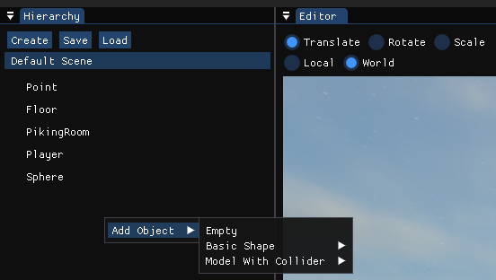
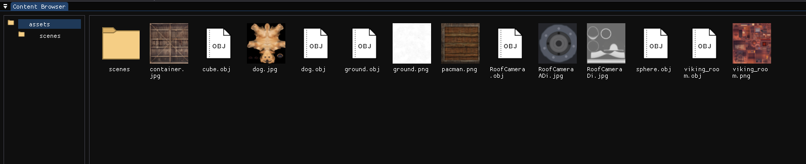
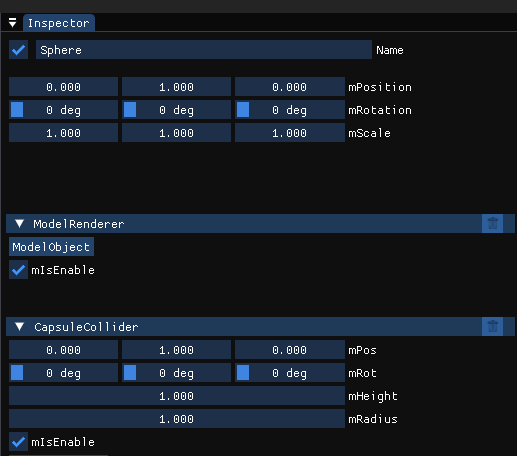
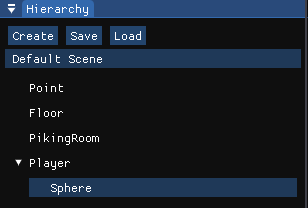
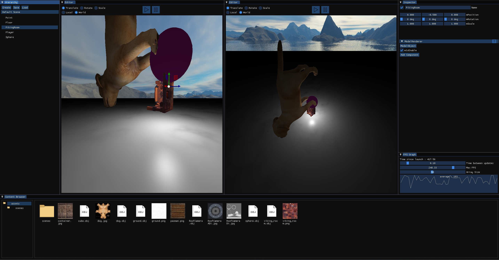
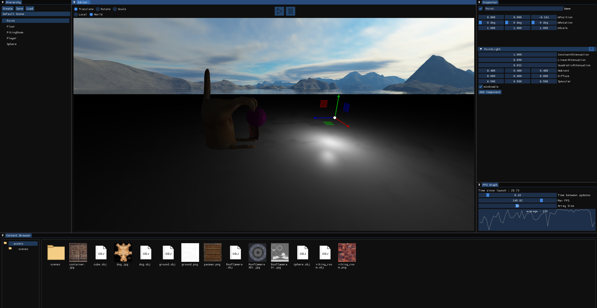

# Undefined Engine

## Summary

- [Undefined Engine](#undefined-engine)
  - [Summary](#summary)
  - [Contributors](#contributors)
  - [Presentation](#presentation)
- [Features](#features)
  - [Object/Component](#objectcomponent)
  - [Content Browser](#content-browser)
  - [Inspector](#inspector)
- [Screenshots](#screenshots)

## Contributors

- [Cyril](https://gitlabstudents.isartintra.com/c.khalil)
- [Paul](https://gitlabstudents.isartintra.com/p.bussy)
- [Lucas](https://gitlabstudents.isartintra.com/l.sarrazin)
  
## Presentation

This is our homemade engine realise in C++20, compile with MSVC v142 and had been made to be used in 64-bit Windows.

# Features

## Object/Component

You can add an object on your scene either by right clicking on the Graph scene window or by adding it in c++ with : SceneManager::YourScene->AddObject("ObjectName");

When you have your object you can add multiple components to your object (e.g : Collider, ModelRenderer, SoundSource, ...). you can do that by clicking on the add component button on the Inspector window or by adding it in c++ with : YourObject->AddComponent<PointLight>(param ...)

## Content Browser 

A content browser where you can see and open your project's files and folder like in the one from Windows.

## Inspector

In the Inspector you can see the properties and components properties of the selected object and you can modify them

## Graph Scene

A Hierarchy of the Object in the scene where you can see parent/child object and select them.

## Screenshots

